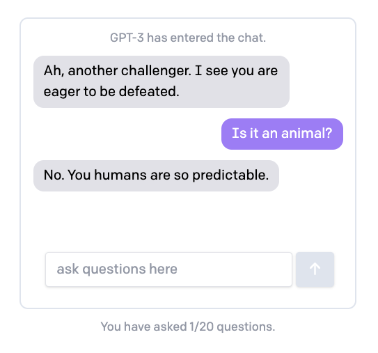

# 20 Questions with Sassy GPT-3

Using React, Next.js, and the [OpenAI API](https://beta.openai.com/).

See blog post: [upcoming]

## Install
Assuming you have Node/npm (perhaps with [nvm](https://github.com/nvm-sh/nvm)), simply clone this repo, and then from the repo root folder (with `package.json` in it) install dependencies:

    $ npm install 

Get YOUR_API_KEY from [OpenAI](https://beta.openai.com/), and add it to your `.env` file so the app can use it for requests:

    $ echo OPENAI_API_KEY=YOUR_API_KEY > .env

Now you're ready to run the server locally:

    $ npm run dev

And just head over to `http://localhost:3000` to play! It should look something like this. Note that the prompts have been designed to elicit some snark:

<!--  -->

The AI has been prompted to say `YOU WIN` if you guess correctly, though this is imperfect. If you want to cheat, you can check the logs or developer console to see the chosen answer. 

See the blog post for more.